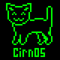

# CirnOS
CirnOS is an operating system for the Raspberry Pi built for the purpose of usability and simplicity. It provides a simple environment for running Lua scripts on Raspberry Pi. It has no kernel, but can use coroutines for time management. You run your code on the device, and that is it.

CirnOS has only been tested on the Raspberry Pi Zero, but should work on the original Raspberry Pi and the Zero W. It is in development for Raspberry Pi 3.

Why use CirnOS when there's Raspbian?
-----
Raspbian is significantly more complex than what most Raspberry Pi users need. Often, an rPi is used for one specific embedded task. Like Arduino, it does not need a kernel, or different protection levels, or an operating system taking up hundreds of megabytes.

The workflow that Raspbian creates is also rather clunky. Without knowledge of SSH, it requires the user to plug in a keyboard, mouse and screen into their Raspberry Pi to program and configure it, while the project that the rPi is used for might not need any of these peripherals. Furthermore, setting up an application to run automatically is not straightforward given the tremendous number of ways to accomplish the task (CRON, systemd, initd, upstart, etc).

Therefore, it makes sense to have a lightweight, extensible system that allows a user to treat the rPi as an embedded device and edit its scripts directly from their computer.

Using CirnOS
-----
- Format your rPi's SD card as FAT32, using a tool such as SD Association's SD Memory Card Formatter <https://www.sdcard.org/downloads/formatter_4/>.
- Make sure the root directory in the SD Card is empty, and that the SD Card has only one volume.
- Copy all files from ROOTDIR into the root of the SD Card.
- Copy kernel.img from OBJ into the root of the SD Card.
- Edit main.lua to control the rPi.

# Building
Arch Linux
-----

Building CirnOS on Arch Linux requires an installation of the GNU Arm Embedded Toolchain, which can be found at <https://www.archlinux.org/packages/community/x86_64/arm-none-eabi-gcc/>.
Once installed, run build.sh in the project directory to create the kernel.img in the object folder.

Fedora
-----
Building CirnOS on Fedora requires a full installation of the GNU Arm Embedded Toolchain, which can be set up by first installing the relevant binutils package found at <https://rpmfind.net/linux/rpm2html/search.php?query=arm-none-eabi-gcc> and then installing Newlib, which can be found at <https://apps.fedoraproject.org/packages/arm-none-eabi-newlib>. Following installation, run build.sh in the project directory to create the kernel.img file in the object folder.

Why the name 'CirnOS'?
-----
CirnOS was built for use in my virtual pet project. This project was originally going to use 9front as its operating system, but I decided that 9front was too excessive for the tasks I needed my virtual pet to do. When I was using 9front it made sense to name my virtual pet after the mascot of the 9front operating system, the Touhou character Cirno. The name CirnOS is therefore a portmanteau of Cirno and OS.

This may alienate some Touhou fans, but to differentiate CirnOS from the Touhou character, the preferred pronounciation of CirnOS is 'Sirnoce'.
